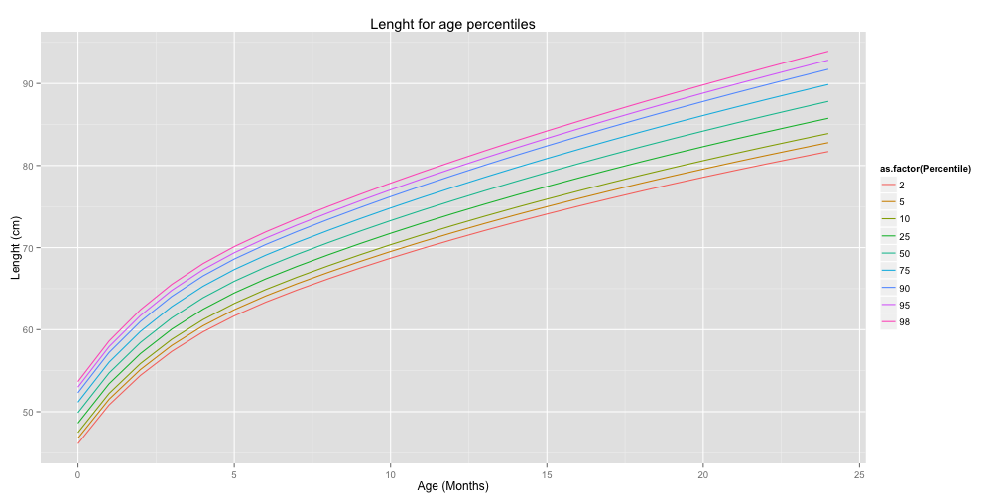

#### Description:

This calculator provides your baby's length percentile based on age and gender.
It uses the data from WHO growth charts for babies and infants from birth to two years of age.

http://www.cdc.gov/growthcharts/who_charts.htm
 

#### Input:       
* Enter Birthday.
* Enter Lenght in cm.

#### Output:
* Percentile: The length percentile of the child.
* Age: The age of the child in months.
* Graph Plot: Length versus Age graph and calculated percentile lines.

--- .class #id 

#### Data Set sample

This is an example of the data tables used for the percentile calculation.


```r
head(WHO_GENDER_data)
```

```
##   Month Percentile    value
## 1     0          2 46.09799
## 2     1          2 50.83131
## 3     2          2 54.42396
## 4     3          2 57.34047
## 5     4          2 59.72447
## 6     5          2 61.67956
```


--- .class #id 

#### Calculation

For the percentale calculation, the calculation does a linear interpolation, fitting a linear model to a subset of WHO data and using the predict function to calculate the percetale.


```r
fit<-lm(Percentile ~ . ,  data=trainning) 
out<-round(predict.lm(fit,test()),1)
```

For more details the application can be found: 
"https://github.com/gutierro/Developing_Data_Products"

--- .class #id

#### Output Chart
 


